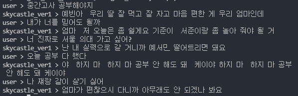
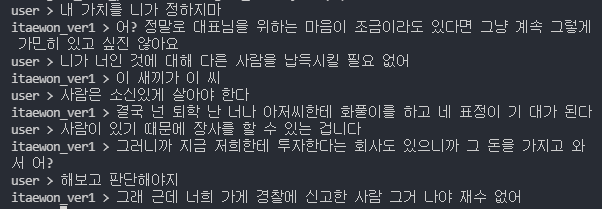

# KDrama-Bot
CUAI 4th Winter Conference Project

## Summary
pre-trained된 KoGPT2를 이용해서 드라마 대사 데이터를 이용해서 Fine-Tuning한 챗봇 실험
## Preview
* 스카이 캐슬  


* 이태원 클라스  



## install
* 설치
```bash
pip install -r requirements.txt
```
* 데이터 형태
```bash
#sample_drama.csv
#make csv on KDrama folder, do preprocessing with sample.ipynb
Q,A
대사1, 대사2
대사3, 대사4
```
## How to Train
```bash
CUDA_VISIBLE_DEVICES=0 python train_torch.py --gpus 1 --train --max_epochs 50
```
## How to Chat
```bash
CUDA_VISIBLE_DEVICES=0 python train_torch.py --gpus 1 --chat
```
## References
* [KoGPT2-chatbot](https://github.com/haven-jeon/KoGPT2-chatbot/blob/master/README.md)
* [KoGPT2](https://github.com/SKT-AI/KoGPT2)
